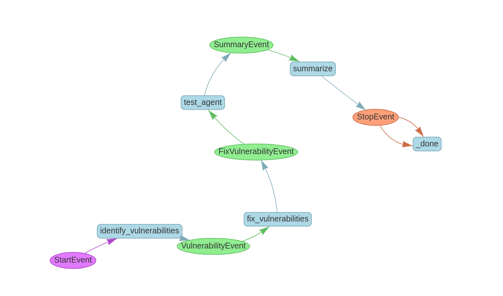

# CyberGuard

CyberGuard is an  agent designed to enhance the security of your Python code. Leveraging the power of **E2B**, **Fireworks** and **Qdrant**, CyberGuard identifies potential security vulnerabilities, automatically fixes them, and verifies the fixes through comprehensive testing. T


## Features

- Vulnerability Detection: Automatically scans your Python code to identify potential security = vulnerabilities.
- Automated Fixes: Suggests and applies fixes to the detected vulnerabilities, ensuring your code adheres to best security practices.
- Testing & Verification: Runs automated tests to verify that the fixes are effective and that the code remains functional.

## Workflow



## Installation

1. Install dependencies

```bash
uv sync --frozen
```

2. Create a .env file in the project root with the following content:
```bash
FIREWORK_API_KEY=
E2B_API_KEY=    
QDRANT_API_KEY=
QDRANT_URL=
```
3. Run the application
```bash
uv run streamlit run main.py
```

3. Open your browser and navigate to http://localhost:8501 to access the CyberGuard interface.

## Usage

1. Access the Interface
Upon running the application, you'll be presented with the CyberGuard UI.

2. Input Code: Paste your Python code into the chat input.

3. Analyze: The agent will analyze the code for vulnerabilities, suggest fixes, and run tests.

4. View Results: Review the vulnerabilities detected, the fixes applied, and the results of the tests to ensure your code is secure and functional.


## Author

- [Suraj Vinaykumar](https://github.com/Surajvinaykumar)
- [bastienpo](https://github.com/bastienpo/)